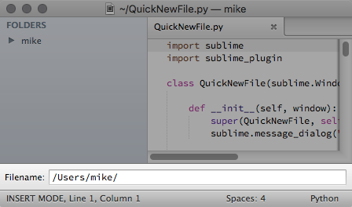

# Sublime QuickNewFile

This is a small Sublime Text plugin which mimics Atom's new file function. 

Instead of opening a blank file, it displays an input initialised with the current file's directory (if no files are open, it'll try to figure a directory to use). Add a filename and you're good to go.

## Features

- Can be used to open existing or create new files.
- Initial directory used is the directory of current active file, falling back to project root then home directory.
- Tab-based auto-complete for directory. Hit tab multiple times to cycle results.
- Will create missing directory in the folder tree as needed.

## Install

Install by cloning this repository into your Sublime Text packages folder:

- OS X: `~/Library/Application Support/Sublime Text 3/Packages`
- Windows: `%APPDATA%\Sublime Text 3\Packages`
- Linux: `~/.config/sublime-text-3/Packages`

## Using

The default hotkey is `super-alt-n`, where `super` is the `win` or `cmd` key, depending on your platform.

There is also an entry in the File menu.

## Credits

I learned a lot from [Sublime-AdvancedNewFile](https://github.com/skuroda/Sublime-AdvancedNewFile), it was invaluable in understanding the structure of a non-trivial Sublime Text plugin.

[How to Create a Sublime Text 2 Plugin](http://code.tutsplus.com/tutorials/how-to-create-a-sublime-text-2-plugin--net-22685) was also a great guide.

## Why a new plugin

One of the few things I preferred in Atom was the way it creates new files. Prompt you for the path, then open the file. For what ever reason, that just fitted for me better than Sublime's method of creating a blank buffer and then prompting for location when it's saved. I also found that the folder Sublime defaulted to was often not the one I expected or wanted.

I tried [Sublime-AdvancedNewFile](https://github.com/skuroda/Sublime-AdvancedNewFile). It's a great plugin with a bunch of options, but none where I could have the path directly manipulatable inside the input box. As that feature is key for me in the Atom implementation, I had to move on. However, certainly give Sublime-AdvancedNewFile if this plugin doesn't fit your needs -- it's much more powerful and configurable.
